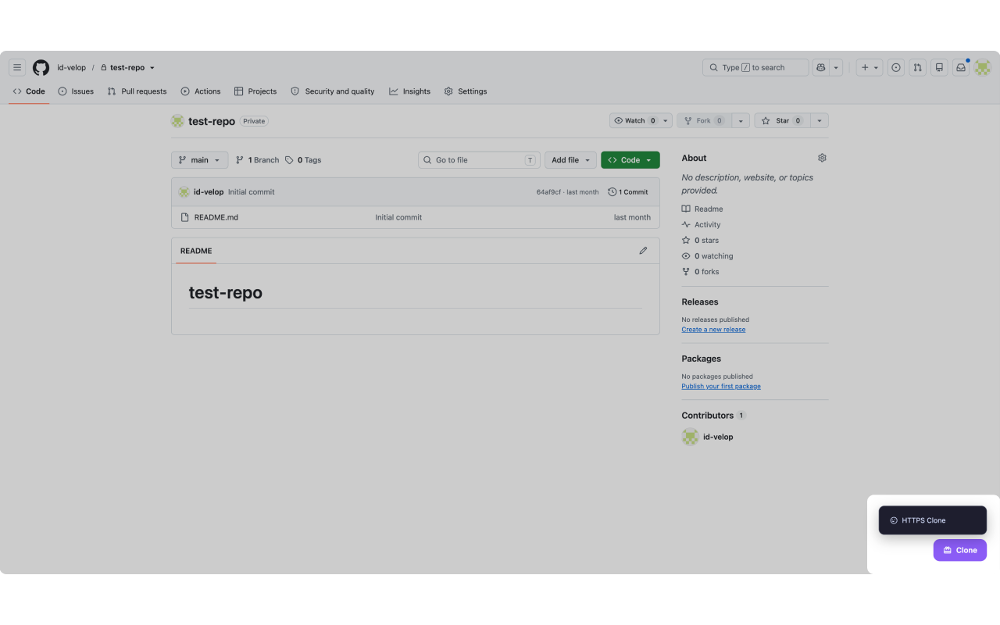
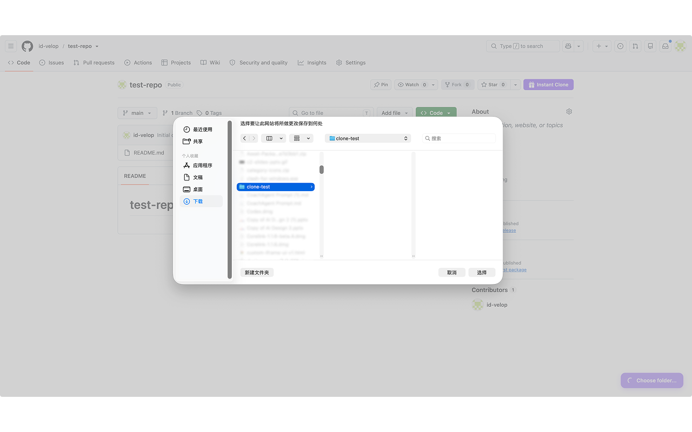
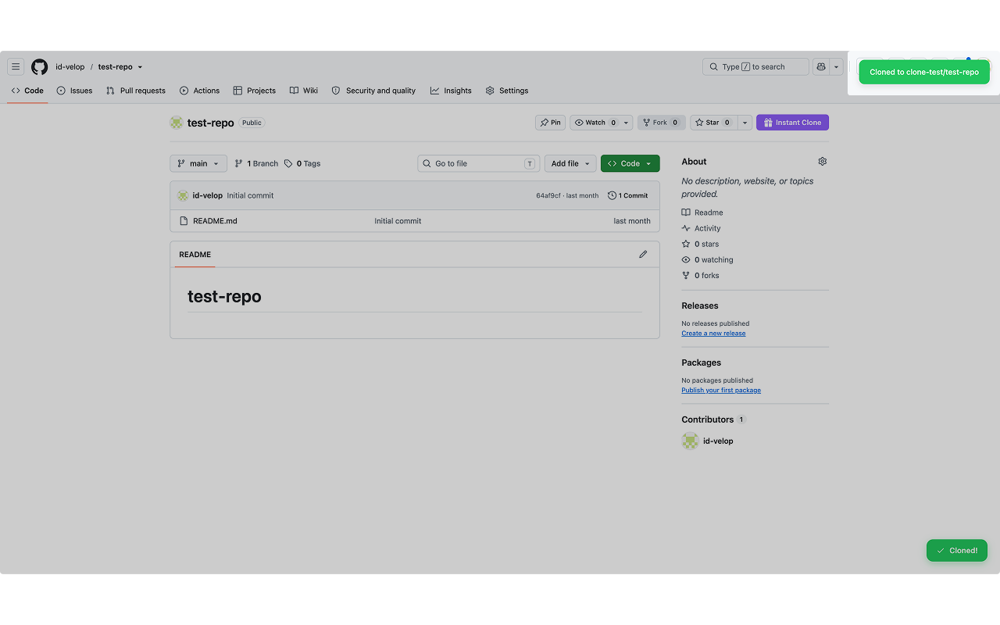
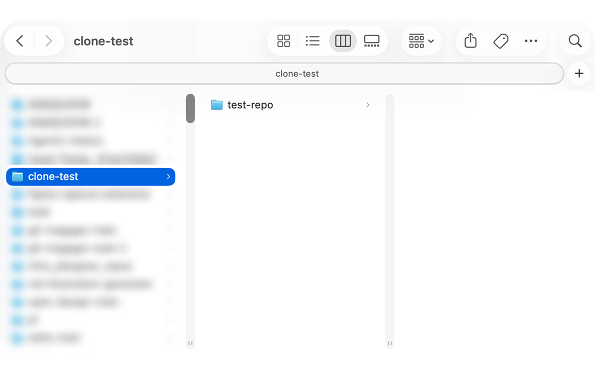

# Git Clone Manager

The maintained source for the Git Clone Manager Chrome extension.

- `extension/` — unpacked extension source; load this directory in Chrome for local development.
- `releases/` — packaged release archives.

The public product page and privacy policy live at
[id-velop.github.io/clone-manager](https://id-velop.github.io/clone-manager/).

## Access model

- Every installation includes 5 free clone attempts.
- Pro unlocks unlimited cloning with a one-time purchase.
- Early Access price: $4.99. Planned regular price: $9.99.
- Existing paid users keep access to the current core Pro features.

The checkout price is configured in the ExtensionPay dashboard and must match
the price shown in the extension and product page before publishing.

## Preview

## Open source or ready to use

本仓库是开源的，你可以自行安装和使用源码。如果不想自己安装，也可以付费使用 [Chrome extension](https://chromewebstore.google.com/detail/clone-manager/hckpgnffhjfblnaehcnchfhaihebmkfo)。
